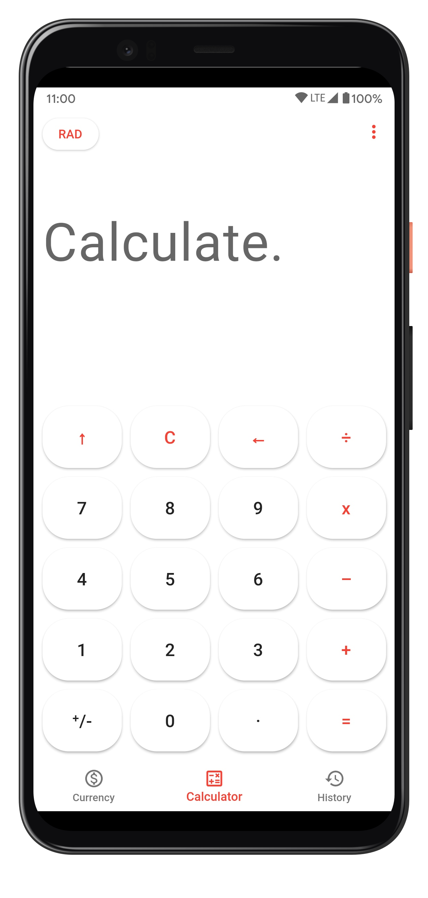
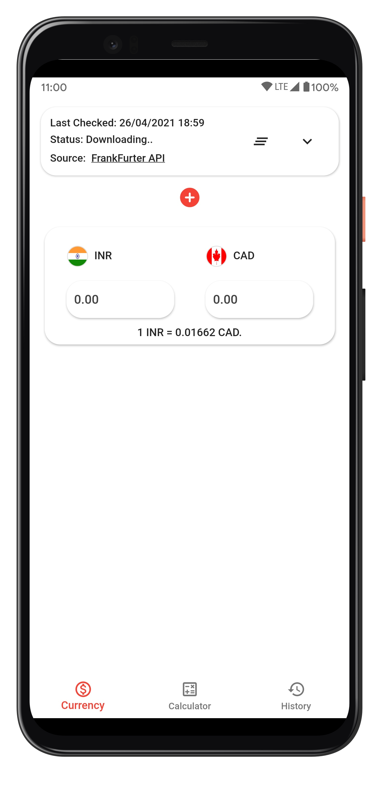

Calculator Lite
======

An Open-Source Calculator that does all the calculations for you. No bloat, just the essentials: Calculator, History & Currency Tabs.

|                                     Calculator Tab                                     |                                   History Tab                                    |
| :------------------------------------------------------------------------------------: | :------------------------------------------------------------------------------: |
|  |  |

|                                    Currency Tab                                     |                                           Export Screen                                           |
| :---------------------------------------------------------------------------------: | :-----------------------------------------------------------------------------------------------: |
|  |  |

Features
------
* Switch easily between Calculator, History, Currency Tabs.
* Add Currency Cards.
* Auto-Update Currency data using a Free API.
* Toggle between Dark/Light/System default themes.
* Export history to Microsoft Excel Format (.xlxs)
* Enable/Disable Screen Recording and Screenshots using Secure Mode.
* Various Advanced Calculator functions like Inverse Trigonometry , Smart +/- function etc.
* Open-source & Privacy friendly. 
* Built with [Flutter](https://flutter.dev) 2.
* Beautiful UI and Smooth Animation Transitions.
* Intuitive design for History and Currency Cards.

Download
------

Notes
------
For Currency data, A free and MIT Licensed API is being used. If at all this service goes down, I'll try my best to update the app as soon as possible with a new API.

Buy Me a Coffee
------
Support me through **in-app purchase** available within the app on Play Store. Please also write a good review, Thank you 😄

Credits
------
* Icons made by [Pixel Buddha](https://www.flaticon.com/authors/pixel-buddha) from [www.flaticon.com](https://www.flaticon.com)
* App Screenshots created with [MockUPhone](https://mockuphone.com).
* Much Thanks to [Frankfurter](https://www.frankfurter.app) for the Currency API.
